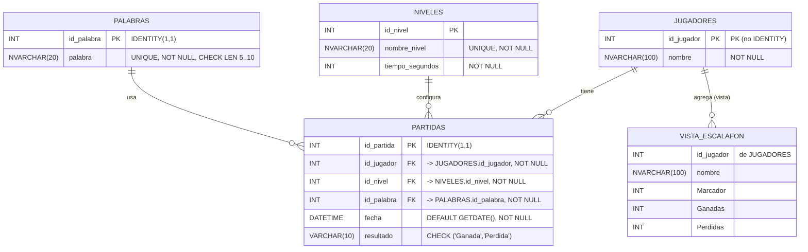

# AhorcadoMVC – Proyecto Grupo #2

# Integrantes

Nombre                               Carné            Usuario GIT                          Correo GIT
Jazmin Pamela Montenegro Baltodano | FI23032284   |   JazminPamelaMontenegroBaltodano   |  jmontenegro00328@ufide.ac.cr
Mariano Mora Arrieta               | FI23032359   |   MarianoM31                        |  marianomora31@hotmail.com
Argenis David Cerrato Amador       | FH23015629   |   imDavid64                         |  davidamador0999@gmail.com
Nelson Rodriguez lopez             | FI20016869   |   nelson2587                        |  nrodriguez087@gmail.com

# Diagrama (Mermaid)
### Diagrama (Mermaid)

# Prompts de IA usados

Prompts: Necesito un partial para mostrar el escalafón ordenado por Marcador
Respuesta: Crea RankingItemViewModel y una acción HomeController.Ranking() que consuma Vista_Escalafon

# Sitios Consultados

- Chatgpt
- Google 
- https://www.youtube.com/watch?v=C4kahP-ucT0&t=1s
- https://gist.github.com/keraf/b3d5bacc7be1d4e681bfbac91722957e
- https://github.blog/developer-skills/github/include-diagrams-markdown-files-mermaid/

